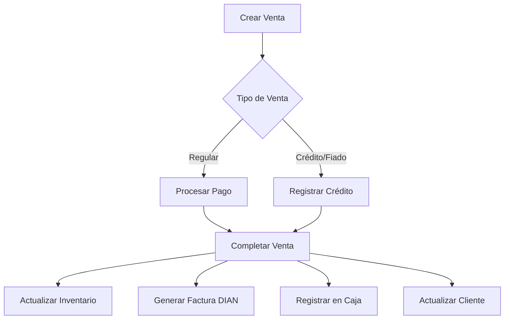

# 🔗 NexoPOS - Integración de Módulos para MVP

## ✅ IMPLEMENTACIÓN COMPLETADA

### 1. **Módulo de Integración Central** ✨ NUEVO
- **Ubicación**: `/src/modules/integration/`
- **Propósito**: Coordinar operaciones entre módulos evitando dependencias circulares
- **Funcionalidades Implementadas**:
  - ✅ Completar venta con todas las integraciones
  - ✅ Cancelar venta y revertir operaciones
  - ✅ Procesar pagos parciales de créditos
  - ✅ Cierre diario de caja

### 2. **Sistema de "Fiado" (Crédito)** 💳 COMPLETO
- **Entidades Nuevas**:
  - `Customer`: Actualizada con gestión de crédito
  - `CustomerCredit`: Nueva entidad para historial de créditos
- **Funcionalidades**:
  - ✅ Límites de crédito configurables
  - ✅ Control de saldos y disponible
  - ✅ Historial de créditos y pagos
  - ✅ Gestión de vencimientos
  - ✅ Recordatorios por WhatsApp (estructura lista)

### 3. **Flujo de Integración Implementado**



## 🚀 ENDPOINTS DE INTEGRACIÓN

### Integration Controller
```typescript
POST /integration/sales/:id/complete    // Completar venta
POST /integration/sales/:id/cancel      // Cancelar venta
POST /integration/sales/:id/partial-payment  // Pago parcial
POST /integration/daily-close          // Cierre diario
```

## ⚠️ REQUISITOS PENDIENTES DE IMPLEMENTACIÓN

### 1. **Actualizar Servicios Existentes**
Los siguientes métodos necesitan ser agregados a los servicios existentes:

#### SalesService (`/modules/sales/sales.service.ts`)
```typescript
async findOne(id: string): Promise<Sale>
async findPending(): Promise<Sale[]>
async addPayment(saleId: string, paymentDto: any): Promise<Payment>
```

#### InvoiceDianService (`/modules/invoice-dian/invoice-dian.service.ts`)
```typescript
async generateFromSale(sale: Sale): Promise<InvoiceDian>
async cancelInvoice(invoiceId: string, reason: string): Promise<void>
```

#### CashRegisterService (`/modules/cash-register/cash-register.service.ts`)
```typescript
async getCurrentSession(userId: string): Promise<CashRegisterSession>
async registerSalePayment(sessionId: string, sale: Sale): Promise<void>
async revertSalePayment(sessionId: string, sale: Sale, reason: string): Promise<void>
async registerPayment(sessionId: string, paymentData: any): Promise<void>
async generateZReport(sessionId: string): Promise<ZReport>
async closeSession(sessionId: string, physicalCash: number, userId: string): Promise<any>
```

### 2. **Configuración de Base de Datos**
```bash
# Las nuevas entidades necesitan sincronización
npm run start:dev  # Con DB_SYNC=true en .env

# O crear migraciones
npm run migration:generate -- -n AddCustomerCredit
npm run migration:run
```

### 3. **Testing de Integración**
```bash
# 1. Crear un cliente con crédito habilitado
POST /customers
{
  "documentType": "CC",
  "documentNumber": "1234567890",
  "firstName": "Juan",
  "lastName": "Pérez",
  "creditEnabled": true,
  "creditLimit": 500000,
  "whatsapp": "3001234567"
}

# 2. Crear una venta a crédito
POST /sales
{
  "type": "credit",
  "customerId": "{{customer_id}}",
  "items": [...],
  "payments": []  // Sin pagos para crédito completo
}

# 3. Completar la venta (activar integraciones)
POST /integration/sales/{{sale_id}}/complete

# 4. Verificar:
- Inventario actualizado ✓
- Factura DIAN generada ✓
- Crédito registrado al cliente ✓
- Movimiento en caja ✓
```

## 📋 CHECKLIST DE VALIDACIÓN DEL MVP

### Funcionalidades Core
- [x] **Ventas (POS)**: Crear, calcular, procesar pagos
- [x] **Facturación DIAN**: Generar documentos POS electrónicos
- [x] **Inventario**: Control de stock, movimientos, alertas
- [x] **Caja**: Apertura, cierre, arqueo, movimientos
- [x] **Clientes**: Gestión, sistema de fiado
- [x] **Integración**: Coordinación entre módulos

### Integraciones Críticas
- [x] Sales → Inventory (actualización de stock)
- [x] Sales → Invoice DIAN (generación automática)
- [x] Sales → Cash Register (registro de pagos)
- [x] Sales → Customers (gestión de créditos)

### Requisitos DIAN
- [x] Generación de CUFE/CUDE
- [x] Resoluciones configurables
- [x] Numeración consecutiva
- [x] Cancelación de facturas

## 🔄 PRÓXIMOS PASOS RECOMENDADOS

### Prioridad 1: Completar Métodos Faltantes
1. Implementar los métodos listados arriba en cada servicio
2. Agregar validaciones de negocio
3. Manejar casos edge (stock insuficiente, límite de crédito, etc.)

### Prioridad 2: Seeds y Datos de Prueba
```typescript
// src/scripts/seed.ts
- Crear categorías base
- Crear impuestos (IVA 19%, IVA 5%, Exento)
- Crear productos de ejemplo
- Crear clientes de prueba
- Crear usuario cajero
```

### Prioridad 3: Frontend Básico
1. Pantalla de venta (POS)
2. Lista de productos
3. Gestión de clientes
4. Cierre de caja

### Prioridad 4: Hardware y Periféricos
1. Integración con impresora térmica
2. Lector de código de barras
3. Cajón monedero
4. Datafono (opcional)

## 🐛 DEBUGGING Y LOGS

Para facilitar el debugging, el `IntegrationService` incluye logs detallados:

```typescript
// Ver logs en desarrollo
npm run start:dev

// Logs esperados al completar una venta:
[IntegrationService] Completing sale 123...
[IntegrationService] Updating inventory for sale 123
[IntegrationService] Generating DIAN invoice for sale 123
[IntegrationService] Registering payment in cash register for sale 123
[IntegrationService] Sale 123 completed successfully
```

## 📞 SOPORTE

Si encuentras problemas con la integración:
1. Verifica que todos los módulos estén importados en `app.module.ts`
2. Confirma que las entidades estén sincronizadas con la BD
3. Revisa los logs del servidor para errores específicos
4. Asegúrate de que los servicios exporten sus métodos correctamente

---

**Última actualización**: ${new Date().toISOString()}
**Estado**: Integración base completada, pendiente implementación de métodos auxiliares
